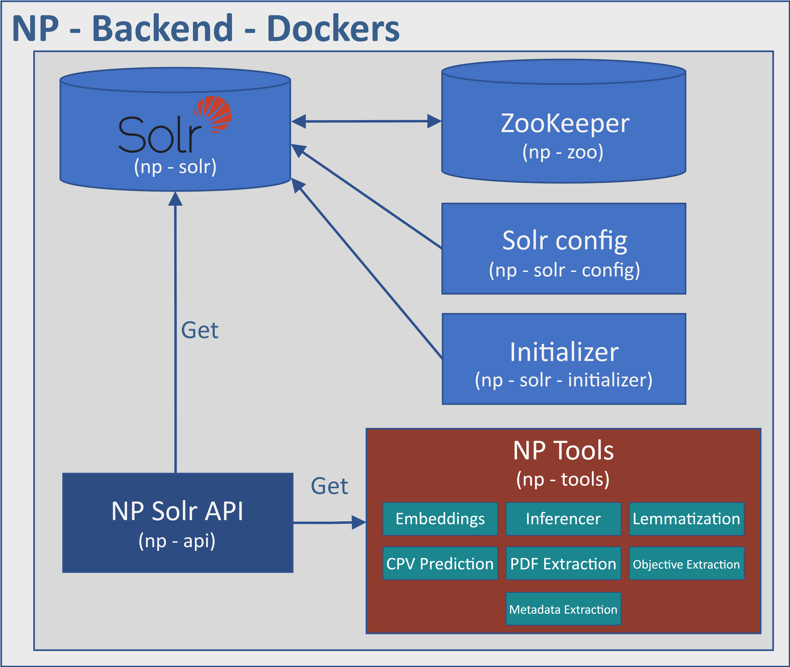

# NP-Backend-Dockers

[](https://github.com/nextprocurement/NP-Backend-Dockers/blob/main/LICENSE)

- [NP-Backend-Dockers](#np-backend-dockers)
  - [Overview](#overview)
  - [Steps for deployment](#️-steps-for-deployment)
  - [Main components](#-main-components)
    - [np-solr-api](#np-solr-api)
    - [np-solr](#np-solr)
    - [np-solr-initializer](#np-solr-initializer)
    - [np-zoo](#np-zoo)
    - [np-solr-config](#np-solr-config)
    - [np-tools](#np-tools)
  - [Usage](#-usage)
  - [Requirements](#requirements)


## Overview

``NP-Backend-Dockers`` powers the backend infrastructure of an application designed for efficient indexing, analysis, and retrieval of textual data leveraging a Solr engine. It also seamlessly integrates additional services like topic-based inference and classification in a multi-container setup, enhancing user functionality.

This multi-container application is orchestrated using a docker-compose script, connecting all services through the `np-net` network.



## Steps for deployment

1. Clone the repository:

    ```bash
    git clone https://github.com/nextprocurement/NP-Backend-Dockers.git
    ```

2. Initialize submodules:

    ```bash
    git submodule init
    ```

3. Update content of submodules:

    ```bash
    git submodule update
    ```

4. Create folder ``data`` and copy model information into it. It should looks as follows:

    

    An example of what should be in the ``data`` folder is available [here](https://drive.google.com/file/d/12sM6sBgaNwAquUiH656LgzT_Iwd4apb-/view?usp=drive_link).

6. Create a network that you can use and replace the ``ml4ds2_net`` in the ``docker-compose.yml`` with the name of your new network:

    ```docker
    networks:
    np-net:
        name: ml4ds2_net
        external: true
    ```

7. Start the services:

    ```bash
    docker-compose up -d
    ```

8. Check all the services are working:

    ```bash
    docker ps
    ```

9. Check that the `NP-solr-dist-plugin` plugin have been mounted properly in Solr. For this, go to Solr (it should be available at [http://your_server_name:8984/solr/#/](http://your_server_name:8984/solr/#/) and create a `test` collection from the following view using the ``np_config`` config set. If everything worked fine, delete the test collection.

    

> If you encounter any problems, write an email to [lcalvo@pa.uc3m.es](mailto:lcalvo@pa.uc3m.es).


## Main components

### np-solr-api

This RESTful API serves as an entry point for indexing and performing a series of queries to retrieve information from the Solr search engine. It essentially acts as a Python wrapper that encapsulates Solr's fundamental functionalities within a Flask-based framework.

It has dependencies on the ``np_solr`` and ``np-tools`` services and requires access to the mounted volumes ``./data/source`` and ``./np_config``.

### np-solr

This service deploys an instance of the Solr search engine using the official Solr image from Docker Hub and relying on the zoo service. It mounts several volumes, including:

- The **Solr data directory** (`./db/data/solr:/var/solr`) for data persistence.
- The **custom Solr plugin** [`NP-solr-dist-plugin`](https://github.com/nextprocurement/NP-solr-dist-plugin), which provides a plugin for performing distance calculations within Solr efficiently.
- The **Solr configuration directory** (`./solr_config:/opt/solr/server/solr`) to access specific Solr schemas for the NextProcurement project data.

### np-solr-initializer

This service is temporary and serves the sole purpose of initializing the mounted volume ``/db/data`` with the necessary permissions required by Solr.

### np-zoo

This service runs Zookeeper, which is essential for Solr to coordinate cluster nodes. It employs the official zookeeper image and mounts two volumes for data and logs.

### np-solr-config

This service handles Solr configuration. It is constructed using the Dockerfile located in the ``solr-config`` directory. This service has dependencies on the Solr and zoo services and mounts the Docker socket and the ``bash_scripts`` directory, which contains a script for initializing the Solr configuration for the NextProcurement project.

### np-tools

This service deploys a RESTful API with a series of auxiliary endpoints for tender processing. The current state includes endpoints for:
- Predicting document-topic representation using a trained model.
- Extracting lemmas from text.
- Predicting the CPV (Common Procurement Vocabulary) code.
- Extracting raw text from PDF files.
- Extracting objectives from documents.
- Extracting metadata from documents.

It has the same mounted volumes as the ``np-solr-api`` service.

## Usage

Visit the [Wiki page](https://github.com/nextprocurement/NP-Backend-Dockers/wiki/NP-Solr-API) for instructions on indexing information into Solr, available queries, and their return formats.

## Requirements

**Python requirements files** available within each "service" folder.

> *Requirements are directly installed in their respective services at the building-up time.*

### Requirements for NP-Tools "Objective Extractor" Namespace

Download [this file](sample_data/ObjectiveExtractor-saved.json) and place it in the mounted volume `data/source`. This file contains the optimized prompt used for objective extraction in the NP-Tools API.

## Acknowledgements

This work has received funding from the NextProcurement European Action (grant agreement INEA/CEF/ICT/A2020/2373713-Action 2020-ES-IA-0255).

<p align="center">
  
  
</p>
